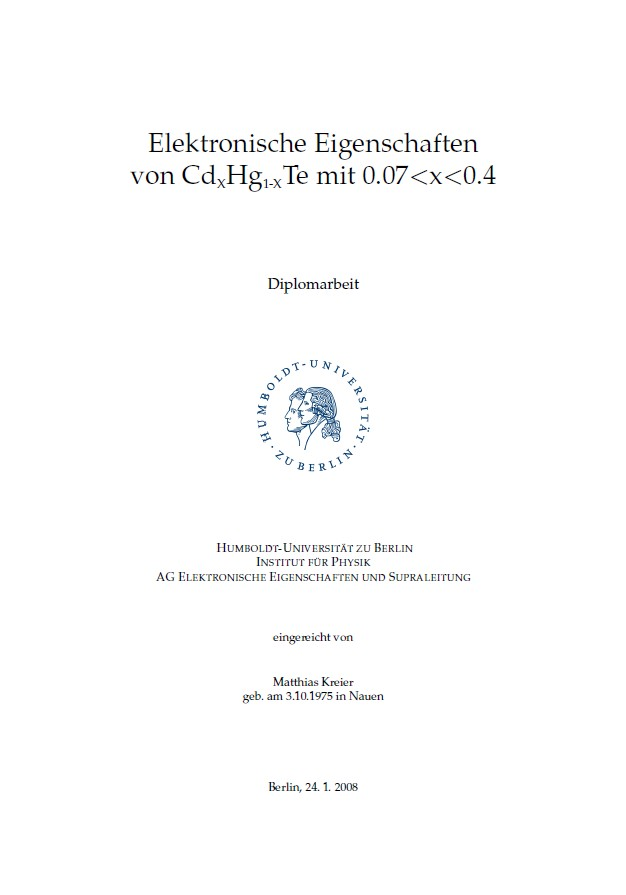
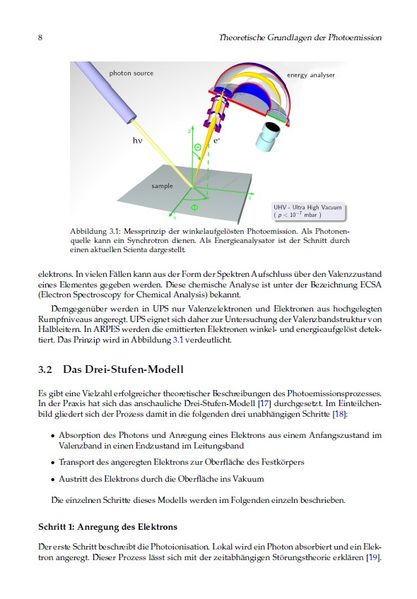
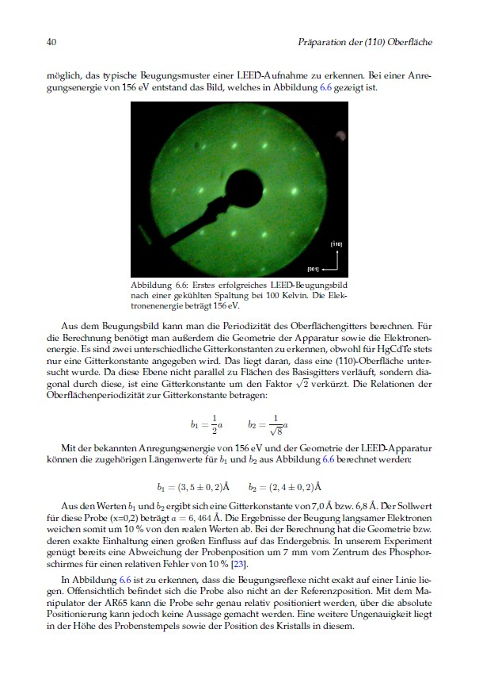
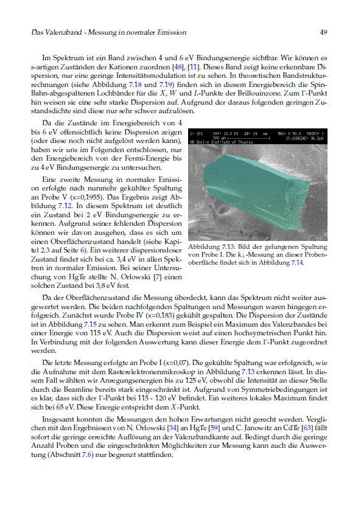

# Diplomarbeit 2008 - my thesis from 2008

This is a recreation of the **diploma thesis** in **physics** from at the _Humboldt Universität zu Berlin_ in 2008.

## Diplom 2008

Die LaTeX Originaldatei ist leider verlorengegangen. Aber da ich die [gerenderte PDF von 2008](2008/20080124.pdf) noch habe, konnte ich daraus eine Kopie erstellen. Es ist auch auf [https://people.physik.hu-berlin.de/~kreier/thesis/20080124.pdf](https://people.physik.hu-berlin.de/~kreier/thesis/20080124.pdf) gehostet.

## Thesis 2008

Surprisingly the English edition of the TEX file is still available. But it was never finished. Well, in 2025, 17 years later, I finally completed this work.

## Diplomarbeit 2025

Eine neue Version wurde unter Linux gerendert. Vielleicht kann ich es sogar mit GitHub Actions automatisieren, das wäre einen Versuch wert. Aber zuerst muss ich die ursprüngliche `.TEX`‑Datei neu erstellen und sie dann an die neue Umgebung des Jahres 2025 anpassen, in der **utf‑8** nativ unterstützt wird und sogar **subscript** in LaTeX keiner speziellen Definition mehr bedarf. Lies [hier mehr](Diplomarbeit/).

## Diploma thesis 2025

This time I finished the translation to English of all 68 pages. But first I have to recreate the original `.TEX` file for the German version and then adjust it for the new environment of 2025 where **utf-8** is natively supported, and even **subscript** needs no specific definition in LaTeX. Read [more here](Diplomarbeit/)

## ArXiv

It was an idea from long ago, and now I finally uploaded my diploma thesis to ArXiv

- Diplomarbeit 2008 doi:whatever
- Thesis 2008 doi:english one

